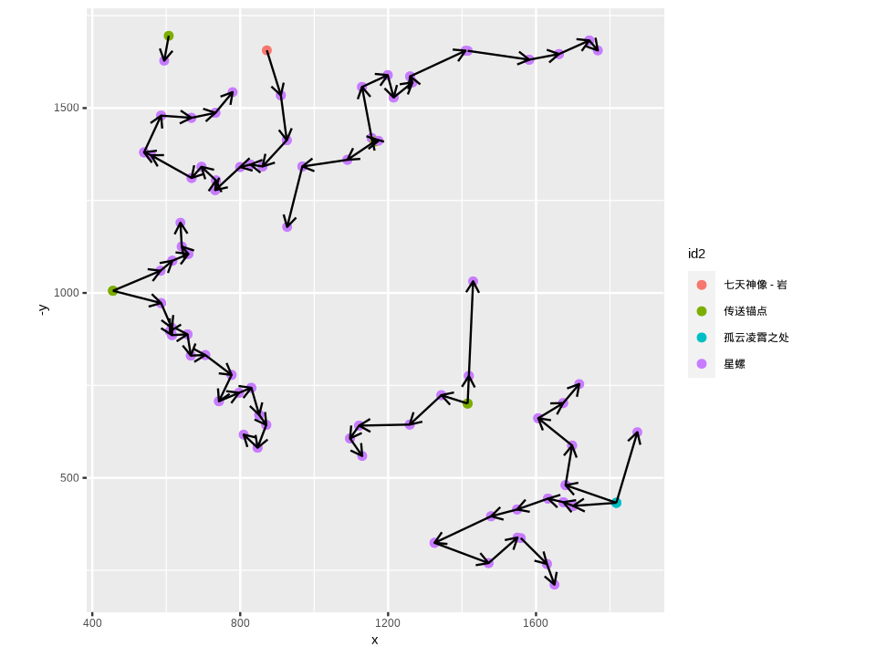
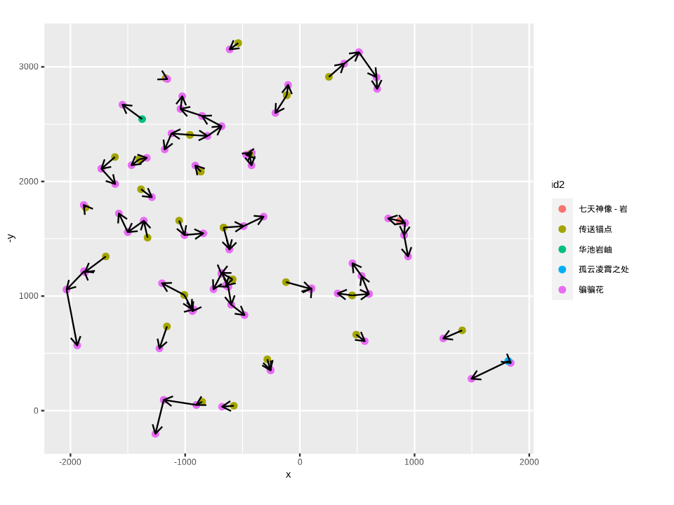

# GenshinTSP: 基于非对称旅行商问题求解的原神最优采集/讨伐路线 (WIP)
- 利用[Kongying酒馆](https://github.com/kongying-tavern/)的json地图数据（位于C:\Users\\%USERNAME%\AppData\LocalLow\空荧酒馆\Map\Resources\POI_JSON_API）
- 因为传送锚点单向传送（任何点到传送锚点距离均为0，或一个loading time的常量）、采集/讨伐过程中可多次访问的特点，无法直接使用TSP求解
- 因此，在建模为非对称TSP求解（每一个点复制出一个dummy point）的基础上，将每个传送锚点复制4份，最终求解
- TSP求解使用了Lin-Kernighan启发式算法，随机运行500次取最优
- 随后删除任何指向传送锚点的边，并进行可视化
- 同时可导出至kongying酒馆的json画布路线

## TODO
- 实现地图贴图，图片导出时自适应地图缩放
- 考虑单位时间获取量，给出最优效率路线排序
- 区分地上地下位点
- [考虑地形因素](https://github.com/Sam5440/Genshin_Impact_Teleport)
- 改为基于整数规划的实现（传送锚点无需约束）

## Demo

